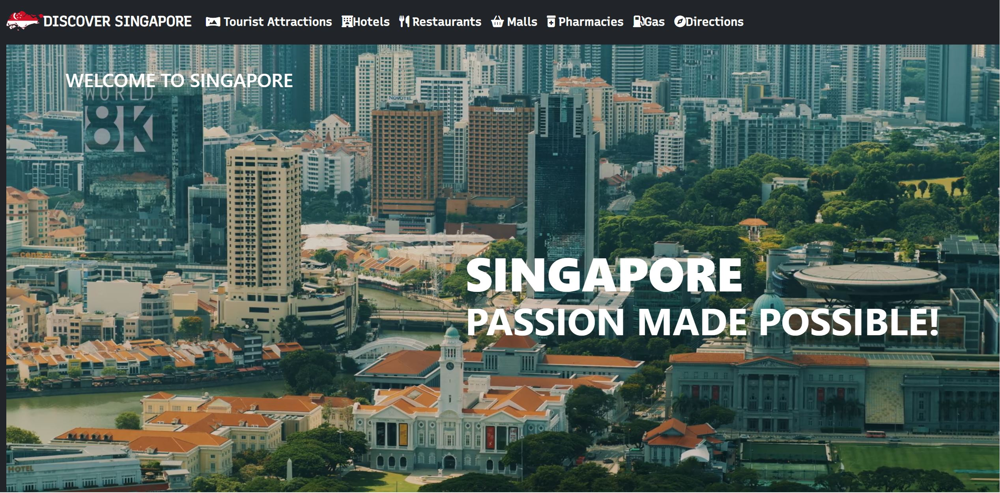
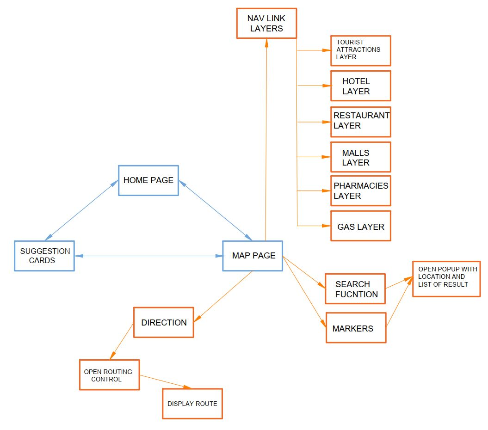
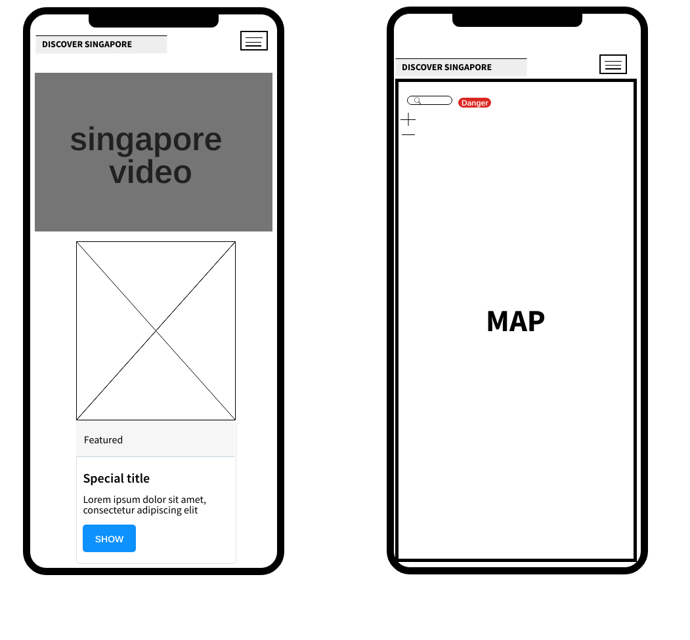
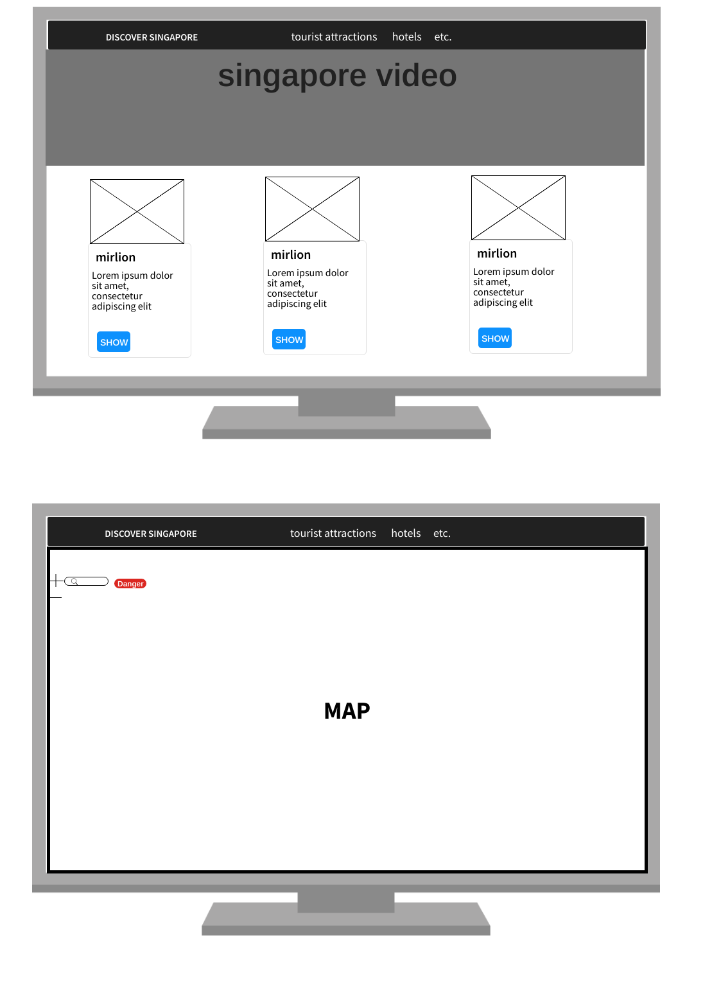

# Discover Singapore

 

## Project Summary

### Project Context

Discover Singapore  is a mobile-responsive website with an interactive map that you can  use to discover all famous tourist attractions throughout Singapore while also having the capability to search all the necessities a tourist could need.

### Target Audience

The target audiences are the locals and tourists. that plans to enjoy their vacation or weekends to discover something new or want an application to guide them. 
### The characteristics 
People who are open to new adventures or have fun in their vacation or free time. 

### Organisational Goals

The web application aims  promote beautiful beaches, stunning landscapes, modern city, cultural and culinary delights,with the warmth and hospitality of the Singaporean people.

### User Goals

The users of the web application want to discover singapore and have everything that a tourist needs. the web application allows user to achive this goal by providing location of various tourist attractions it also can provide hotels,malls,restaturans and can search for a specific places the user want while also having the capability to calculate Route service calculates a route between an origin and a destination by using leaflet routing machine. 

### Justification for the App

To discover famous tourist spots, users would currently have to do an internet search which return countless articles and would have missed unknown locations to the user. The articles are wordy, and it can take the users some effort to find the location of different tourist spots The web application provides a convenient way to navigate in singapore on an interactive map and to provide other useful features to aid users to plan a vacation if they would like to.

The live demo to the website can be accessed [here](https://engroliver.github.io/Oliver-Assignment-1/).

## UI/UX

### Strategy

**Organisation**
* Objective: To promote various tourist attractions within Singapore.

**User**
* Objective: To Guide and discover Singapore.

* Needs: An easy way to know the locations of tourist attractions and routing directions to navigate through singapore.

* Demographic: The characteristics (e.g., age, occupation, educational level and IT literacy level) of the users cover a wide spectrum. Any user that is planning to go on a vacation in Singapore and having planing the tourist location and routing is a target audience. Therefore, the web application should be simple to use and intuitive.

* Pain point: People who have never been to singapore and doesn't know what location to search online and would have trouble routing to the location.

User Stories | Acceptance Criteria(s)
------------ | -------------
As a local or tourist interested in visiting Singapore's famous tourist spots, I want to be able to easily locate them. | <ul><li>Search function</li><li>Feature to display location of various tourist attractions</li></ul>
As a person who is lost in the city and have trouble locating he's  geographic location |<ul><li>Feature to show curren location</li></ul>
As a person who's having difficulties in navigating from one place to another in singapore   | <ul><li>Feature to calculates a route between a given origin and destination</li></ul>

### Scope

**Functional Requirements**

Features
* Display tourist attractions layer
* Display hotels layer
* Display malls layer 
* Display Restaurants layer 
* Display pharmacies layer
* Display gas stations layer
* Search for specific locations
* Show current location of user
* calculates a route between a given origin and destination

Content
* Information on the tourist attractions (name, description, and image)
* Location of tourist attractions (achieved by markers on map)

**Non-functional requirements**

* Performance criteria
* Mobile responsiveness

### Structure

 

### Skeleton
wireframes for mobile and laptop display for the web application

**Mobile**

 

**Laptop**

 

### Surface
**Colours**: color scheme is white and red to replicate singapore flag and default bootsrap dark for simplicity 

 

**Font Choice**:  font-family: 'Recursive', sans-serif; are used for its simplicity and perceptibility. 

**Icons and Markers**: markers and icons are selected to contrast the color of the map so the user can easily see the locations.

## Features
Features | Descriptions
-------- | -------------
Display tourist attractions layer | This feature through stored geojson file from data.gov.sg can display  tourist attraction  icons with description,location and image.
Display hotel,restaurant,malls,phamacies and gas layers| This feature through foursquare database can display the icons with name and location of said layers.
Search for places | This feature uses foursqaure database by querying name, category name, taste label, or chain name and displaying it to the map through marker with name and location.
Leaflet Routing Machine | Calculates a route between a given origin and destination

### Limitations and future implementations
Limitations | Future Implementations to Resolve Limitations
----------- | -------------
Routing Machine doesn't display traffic and current location | Create more comprehinsive program with an api that could provide real time traffic data.
web application have only 1 language | Create a function to translate accurately so that everyone from other country could use the application.
suggestion doesn't store in data base| Crate a database and improve function

## Testing

### Test Cases
The test cases can be found [here](https://github.com/engroliver/Oliver-Assignment-1/blob/main/images/sing%20test.pdf).

## Technologies Used
1. HTML 
    - Used to create the structure of the web application.

2. CSS 
    - Used to design the user interface and improve user experience of the web application.

3. JavaScript
    - Used to create the interactions of the web application

4. [Bootstrap v5.1](https://getbootstrap.com/docs/5.1/getting-started/introduction/) 
    - Used to build and customize the web application by using style/templates and its components 

5. [Leaflet](https://leafletjs.com/) 
    - Used to create the interactive map for the web application

6. [Markercluster](https://github.com/Leaflet/Leaflet.markercluster) 
    - Used to improve user experience for the map.

7. [Leaflet Routing Machine](https://www.liedman.net/leaflet-routing-machine/#:~:text=Leaflet%20Routing%20Machine%20is%20an,the%20user%20interface%20and%20interactions.) 
    - Used to create a routing function in the map.

8. [Leaflet locate](https://github.com/domoritz/leaflet-locatecontrol) 
    - Used to create a geolocate the user

9. [Axios](https://github.com/axios/axios)
    - Used to extract data from geoJSON files and foursquare API.

10. [Fontawesome](https://fontawesome.com/icons)
    - Used to create icons for the nav-links in the web application.

11. [Google Fonts](https://fonts.google.com/)
    - Used to style the fonts in web application.

12. [icons8](https://icons8.com/icons/set/camera)
    - Used to improve markers in the interactive map.

13. [GitHub](https://docs.github.com/en/pages/getting-started-with-github-pages/configuring-a-publishing-source-for-your-github-pages-site)
    - Used for deployment of the web application.

## Deployment
The web application is hosted on Github for instructions click [here](https://docs.github.com/en/pages/getting-started-with-github-pages/configuring-a-publishing-source-for-your-github-pages-site)

## Credits
1. Data.gov.sg
    - Data source for tourist attractions in geojson format  are obtained from [data.gov.sg](https://data.gov.sg/).

2. developer.foursquare.com
    - Data source for place search APIs are obtained from [developer.foursquare.com](https://developer.foursquare.com/reference/place-search)

3. youtube.com
    - Used for aswesome background-video by Around The World 4K in youtube for link click[here](https://www.youtube.com/watch?v=Psr4HZmWHnQ&t=35s)

4. Photos
    -[Mirlion](https://en.wikipedia.org/wiki/Merlion)
    -[Marina Bay Sands](https://en.wikipedia.org/wiki/Marina_Bay_Sands)
    -[Gardens by the Bay](https://planetofhotels.com/guide/en/singapore/singapore/gardens-bay)

5. Guidance
    - Ace,Razia,shung and tay boon siang for being a great TAs

 

